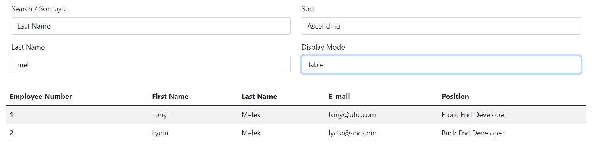
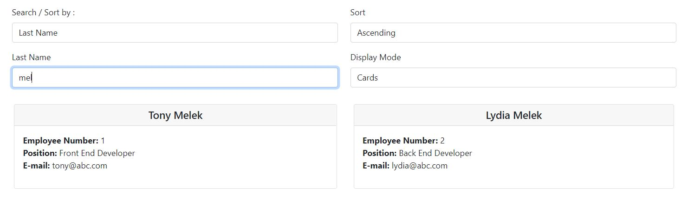

# Employee Directory
* [Description](#description)
* [Installation](#installation)
* [Usage](#usage)
* [License](#license)
* [Contributing](#contributing)
* [Tests](#tests)
* [Questions](#questions)
## Description
The project uses React Hooks to display the info. of employees in tabular and cards display, also search and sort employees ascending  and descending 
## Installation
1. Install Node.js
2. Download or clone the project and navigate to the folder from your preferred terminal.
3. type `npm i ` to install all dependencies.
4. type `npm start` to launch the app.
## Usage
1. Select Search / Sorting Criteria
2. Enter Search Text
3. If you got more than one result, you may choose ascending/descending to sort as required.
4. You can move from tabular to card view at any time.

## Contributing
Contributions are welcome, please feel free to message me your proposal and if approved you will be added as a collaborator to the project
## Tests
You can try and test options as per instructions on the deployed version of the app [Employee Directory](https://employee-table-tony.herokuapp.com/)
## Questions
You are welcome to provide any feedback and/or ask questions.
Please, send any question to my e-mail [tonymelek.au@gmail.com](mailto:tonymelek.au@gmail.com) and/or visit my profile on [Github](https://github.com/tonymelek)

## License
The project is protected under MIT,you may need to read through license conditions